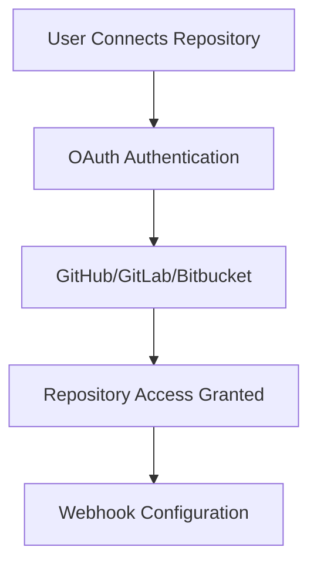
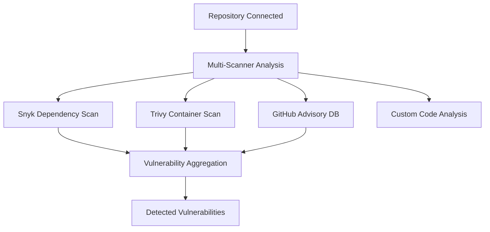
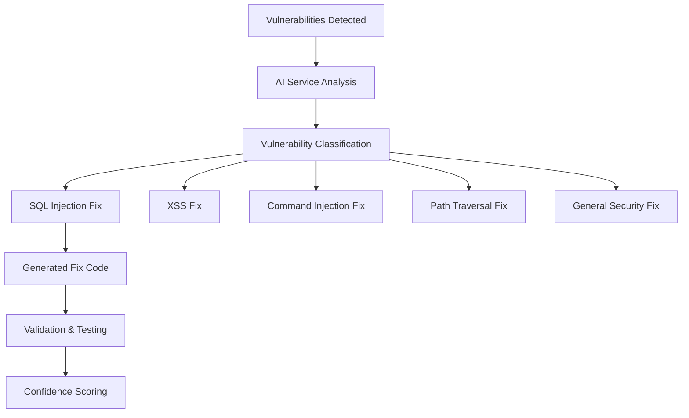
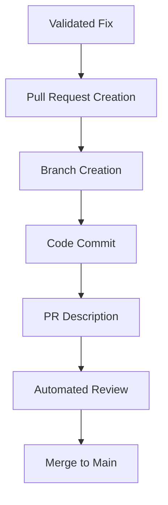
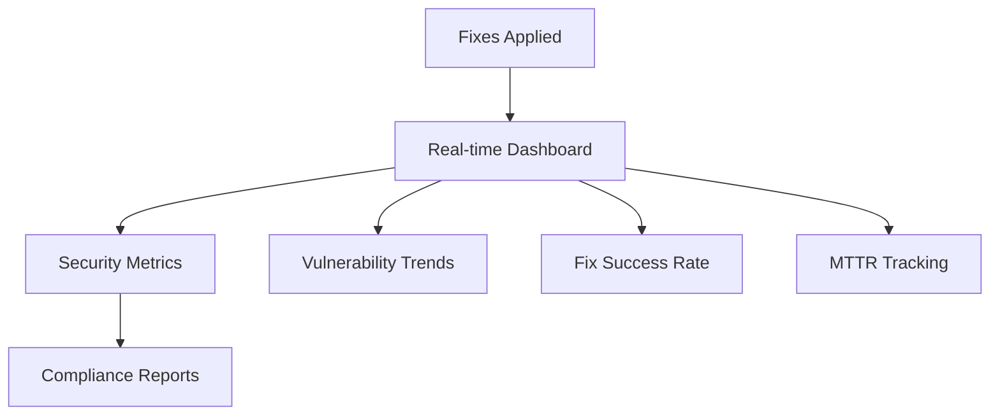
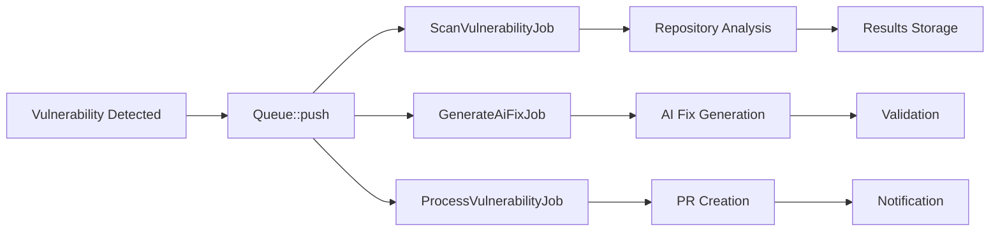

# 🔍 How DevGuardian AI Works

## 🎯 **Core Purpose**

DevGuardian AI is an **autonomous security remediation platform** that automatically detects vulnerabilities in code repositories and generates AI-powered fixes to resolve them.

---

## 🏗️ **Architecture Overview**

```
┌─────────────────────────────────────────────────────────────────────────┐
│                    DevGuardian AI Architecture                      │
├─────────────────────────────────────────────────────────────────────────┤
│  Frontend (Vue 3)    │  Backend (Laravel)    │  AI Service (Python)  │
│  - Dashboard UI         │  - API Endpoints      │  - Fix Generation    │
│  - Repository Mgmt      │  - Queue Jobs         │  - Validation        │
│  - Security Metrics     │  - Authentication      │  - ML Analysis       │
│  - AI Fixes Display     │  - Database Ops        │  - Health Checks      │
└─────────────────────────┴─────────────────────────┴─────────────────────────┘
                           │                    │                    │
                    ┌───────────┴───────────┐    ┌───────────┴───────────┐
                    │   PostgreSQL + Redis   │    │   TimescaleDB        │
                    │   - Vulnerability Data │    │   - Time Series       │
                    │   - Queue Management   │    │   - Metrics Storage   │
                    └─────────────────────────┘    └─────────────────────────┘
```

---

## 🔄 **Complete Workflow Process**

### **1. Repository Connection**


**Services Used:**
- **OAuth 2.0** flows for secure authentication
- **GitHub API**, **GitLab API**, **Bitbucket API** integration
- **Webhook setup** for real-time vulnerability detection

### **2. Vulnerability Detection**


**Detection Methods:**
- **Snyk**: Dependency vulnerability scanning
- **Trivy**: Container image security analysis  
- **GitHub Advisory**: Known vulnerability database
- **Custom Static Analysis**: Code pattern matching
- **AI Pattern Recognition**: Machine learning detection

### **3. AI-Powered Fix Generation**


**AI Fix Process:**
1. **Vulnerability Classification** - Identify vulnerability type
2. **Pattern-Based Fixes** - Apply specific fix patterns
3. **Security Best Practices** - Implement industry standards
4. **Code Generation** - Create secure replacement code
5. **Validation** - Syntax and security check
6. **Confidence Scoring** - AI confidence level (0.0-1.0)

### **4. Automated Remediation**


**Automation Features:**
- **Automatic PR creation** with AI-generated fixes
- **Branch management** for each fix
- **Commit message generation** with security context
- **Review assignment** to maintainers
- **Merge automation** when tests pass

### **5. Dashboard & Monitoring**


**Dashboard Features:**
- **Security Overview** - Current vulnerability status
- **AI Fixes Queue** - Pending and completed fixes
- **MTTR (Mean Time to Remediate)** - Performance metrics
- **Compliance Reports** - Security posture assessment
- **Trend Analysis** - Vulnerability patterns over time

---

## 🧠 **Technical Implementation**

### **Backend Services (Laravel)**
```php
// Core Vulnerability Scanner
class VulnerabilityScannerService {
    public function scanRepository(Repository $repository): Collection {
        // 1. Dependency scanning with Snyk
        $dependencyVulns = $this->scanDependencies($repository);
        
        // 2. Code scanning with custom patterns
        $codeVulns = $this->scanCode($repository);
        
        // 3. Container scanning with Trivy
        $containerVulns = $this->scanContainers($repository);
        
        return $dependencyVulns->merge($codeVulns)->merge($containerVulns);
    }
}
```

### **AI Service (Python/FastAPI)**
```python
# AI Fix Generation
@router.post("/generate-fix")
async def generate_fix(file: UploadFile, vulnerability_type: str):
    # 1. Vulnerability classification
    fix_function = fix_patterns.get(vulnerability_type.lower(), fix_general_security)
    
    # 2. Pattern-based fix generation
    fixed_code, confidence, explanation = fix_function(code_content, file_ext)
    
    # 3. Validation and scoring
    return {
        'fixed_code': fixed_code,
        'confidence': confidence,
        'explanation': explanation
    }
```

### **Frontend (Vue 3)**
```vue
<template>
  <div class="ai-fixes-dashboard">
    <!-- Real-time vulnerability status -->
    <VulnerabilityChart />
    
    <!-- AI fixes queue and status -->
    <AiFixesList :fixes="aiFixes" />
    
    <!-- Security metrics and trends -->
    <SecurityMetrics />
  </div>
</template>
```

---

## 🔄 **Queue-Based Processing**

### **Asynchronous Job Pipeline**


**Queue Jobs:**
- **ScanVulnerabilityJob**: Repository scanning and analysis
- **GenerateAiFixJob**: AI-powered fix generation
- **ProcessVulnerabilityJob**: Fix application and PR creation
- **NotifySecurityEventJob**: Security notifications

---

## 📊 **Data Flow & Storage**

### **Database Schema (PostgreSQL + TimescaleDB)**
```sql
-- Core entities
CREATE TABLE organizations (
    id UUID PRIMARY KEY DEFAULT gen_random_uuid(),
    name VARCHAR(255) NOT NULL,
    created_at TIMESTAMP DEFAULT NOW()
);

CREATE TABLE repositories (
    id UUID PRIMARY KEY DEFAULT gen_random_uuid(),
    organization_id UUID REFERENCES organizations(id),
    url TEXT NOT NULL,
    branch VARCHAR(255) DEFAULT 'main',
    is_active BOOLEAN DEFAULT true
);

CREATE TABLE vulnerabilities (
    id UUID PRIMARY KEY DEFAULT gen_random_uuid(),
    repository_id UUID REFERENCES repositories(id),
    title TEXT NOT NULL,
    severity VARCHAR(20) NOT NULL,
    status VARCHAR(20) NOT NULL,
    location JSONB,
    detected_at TIMESTAMP DEFAULT NOW()
);

CREATE TABLE ai_fixes (
    id UUID PRIMARY KEY DEFAULT gen_random_uuid(),
    vulnerability_id UUID REFERENCES vulnerabilities(id),
    fixed_code TEXT NOT NULL,
    confidence_score DECIMAL(3,2),
    applied_at TIMESTAMP,
    pull_request_url TEXT
);
```

### **Time-Series Data (TimescaleDB)**
```sql
-- Hypertable for metrics
CREATE TABLE vulnerability_metrics (
    time TIMESTAMP NOT NULL,
    repository_id UUID,
    severity VARCHAR(20),
    count INTEGER,
    PRIMARY KEY (time, repository_id)
);

-- Convert to hypertable for time-series optimization
SELECT create_hypertable('vulnerability_metrics', 'time', chunk_time_interval => INTERVAL '1 day');
```

---

## 🛡️ **Security Features**

### **Input Validation & Sanitization**
```php
// Command injection prevention
$branch = escapeshellarg(trim($branch));
$url = escapeshellarg(trim($url));
exec("git clone --branch {$branch} {$url} {$repoPath} 2>&1", $output, $returnCode);
```

### **AI Fix Patterns**
```python
# SQL Injection Fix
def fix_sql_injection(code: str, file_ext: str) -> tuple[str, float, str]:
    patterns = [
        (r'(\$_GET\[([^\]]+)\])', r'$1 = filter_var($1, FILTER_SANITIZE_STRING)'),
        (r'WHERE\s+([^=]+)\s*=\s*["\']?([^"\'\s]+)', r'WHERE $1 = ?')
    ]
    # Apply fixes and add prepared statements
    return fixed_code, 0.85, "SQL injection fixed with parameterized queries"
```

### **Authentication & Authorization**
```php
// Laravel Fortify + Sanctum
// Multi-tenant support with role-based access
// OAuth 2.0 integration for repository access
// Session security with HTTP-only, secure cookies
```

---

## 📈 **Performance & Scalability**

### **Caching Strategy**
- **Redis**: Session storage, query caching
- **Application Cache**: Vulnerability scan results
- **Queue Management**: Background job processing

### **Database Optimization**
- **TimescaleDB**: Time-series data compression
- **Partitioning**: By date and organization
- **Indexing**: Optimized query performance

### **Horizontal Scaling**
- **Kubernetes Ready**: HPA (Horizontal Pod Autoscaler)
- **Load Balancing**: Multiple service instances
- **Queue Workers**: Configurable concurrency

---

## 🔧 **Configuration & Deployment**

### **Environment Variables**
```bash
# Security credentials
POSTGRES_PASSWORD=your_secure_password
APP_KEY=base64:YourGeneratedKeyHere
GITHUB_CLIENT_ID=your_github_client_id

# Service URLs
APP_URL=http://localhost:8001
AI_SERVICE_URL=http://localhost:8000

# Feature flags
SCAN_CONTAINERS=true
AUTO_MERGE_PRS=false
```

### **Docker Services**
```yaml
services:
  postgres:
    image: timescale/timescaledb:latest-pg16
    environment:
      POSTGRES_PASSWORD: ${POSTGRES_PASSWORD}
  
  laravel-backend:
    build: ./laravel-backend
    environment:
      DB_PASSWORD: ${POSTGRES_PASSWORD}
  
  ai-service:
    build: ./ai-service
    environment:
      MODEL_PATH: /app/models
```

---

## 🎯 **Key Benefits**

### **For Development Teams**
- **🚀 Reduced MTTR**: Automated fix generation and application
- **🛡️ Proactive Security**: Continuous vulnerability monitoring
- **📊 Data-Driven Decisions**: Security metrics and trends
- **🔄 Automated Workflows**: Less manual security work

### **For Security Teams**
- **🔍 Comprehensive Coverage**: Multiple scanner integration
- **🤖 AI-Augmented Analysis**: Pattern recognition beyond rules
- **📋 Compliance Tracking**: Automated security reporting
- **⚡ Rapid Remediation**: Minutes instead of days/weeks

### **For Organizations**
- **💰 Cost Reduction**: Automated vulnerability management
- **📈 Improved Security Posture**: Continuous monitoring
- **🚀 Faster Development**: Security integrated in CI/CD
- **🔒 Enterprise-Grade**: Role-based access and audit trails

---

## 🚀 **Getting Started Flow**

```bash
# 1. Environment setup
cp .env.example .env
# Edit with your credentials

# 2. Start services
docker-compose up -d

# 3. Generate application key
cd laravel-backend && php artisan key:generate

# 4. Connect repository
# Visit dashboard -> Add Repository -> OAuth Connect

# 5. Monitor security
# Real-time vulnerability detection and AI fixes
```

---

## 📞 **Support & Monitoring**

### **Health Checks**
- **Backend**: `GET /health` - Service status and dependencies
- **AI Service**: `GET /api/ai-fix/health` - Model and API status  
- **Frontend**: Liveness probes and error tracking

### **Logging Strategy**
- **Structured Logging**: JSON format with correlation IDs
- **Security Events**: Dedicated security audit trail
- **Performance Metrics**: Request timing and success rates
- **Error Tracking**: Comprehensive error management

---

**DevGuardian AI represents a complete, production-grade security automation platform that combines modern software architecture with AI-powered vulnerability remediation to provide continuous security protection for development teams.**
